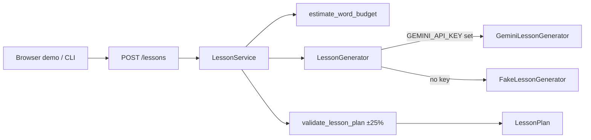

# Journey Tutor

AI-powered personalised learning. Given a **topic**, **duration**, and **difficulty**, Journey Tutor returns a structured lesson plan with learning objectives, ordered sections, and a narrated script — via API, CLI, or a tiny browser demo.

> **Not in this milestone:** Google Maps, TTS/audio playback, databases, auth, RAG, payments, or cloud deploy orchestration.

## Product (MVP v2)

- Structured lesson generation with Gemini (`gemini-2.5-flash` by default)
- App-owned word budget: `duration_minutes × WORDS_PER_MINUTE` (default **130**)
- Deterministic post-generation validation (±**25%** tolerance on total estimated words)
- CLI: `journey-tutor lesson ...`
- Browser demo UI served by FastAPI at `/`
- Fake provider only when **no** `GEMINI_API_KEY` is configured (local/offline). Live failures do **not** silently fall back to Fake.

## Architecture

| Package | Responsibility |
|---|---|
| `journey_tutor.api` | FastAPI routes, request/response schemas, DI, safe error mapping |
| `journey_tutor.domain` | Word budget, post-generation validation, `LessonService` orchestration |
| `journey_tutor.ai` | Replaceable LLM providers (`GeminiLessonGenerator`, `FakeLessonGenerator`) behind a protocol |
| `journey_tutor.config` | Settings from environment variables (no hard-coded secrets) |
| `journey_tutor.cli` | `lesson` and `serve` commands |
| `journey_tutor.static` | Minimal HTML/CSS/JS demo UI |

FastAPI route handlers never call Gemini directly. They depend on `LessonService`, which talks to a `LessonGenerator` implementation. The app owns the word budget and validates the result after generation.



## Requirements

- Python 3.14+
- [uv](https://docs.astral.sh/uv/)
- A Gemini API key for live generation (optional for local tests — fake provider is used when unset)

## Local setup

```bash
# Install dependencies (creates .venv)
uv sync

# Optional: configure Gemini
cp .env.example .env
# edit .env and set GEMINI_API_KEY=...

# Run API + demo UI
uv run journey-tutor serve --reload --host 0.0.0.0 --port 8000
# or: uv run uvicorn journey_tutor.main:app --reload --host 0.0.0.0 --port 8000
```

- Demo UI: <http://127.0.0.1:8000/>
- OpenAPI docs: <http://127.0.0.1:8000/docs>

### Docker

```bash
docker build -t journey-tutor .
docker run --rm -p 8000:8000 -e GEMINI_API_KEY="$GEMINI_API_KEY" journey-tutor
```

## CLI

```bash
uv run journey-tutor lesson \
  --topic "photosynthesis" \
  --duration 15 \
  --difficulty beginner
```

Prints title, duration, word budget, learning objectives, and section titles with word counts.

```bash
uv run journey-tutor serve --port 8000
```

## API usage

### `GET /health`

```bash
curl -s http://127.0.0.1:8000/health
```

### `POST /lessons`

```bash
curl -s -X POST http://127.0.0.1:8000/lessons \
  -H 'Content-Type: application/json' \
  -d '{
    "topic": "photosynthesis",
    "duration_minutes": 20,
    "difficulty": "beginner"
  }'
```

**Request**

| Field | Type | Notes |
|---|---|---|
| `topic` | string | 1–200 characters |
| `duration_minutes` | int | 1–120 |
| `difficulty` | enum | `beginner` \| `intermediate` \| `advanced` |

**Response** includes `title`, `topic`, `duration_minutes`, `difficulty`, `word_budget`, `learning_objectives`, and ordered `sections` (each with `title`, `estimated_word_count`, `narration_script`).

### Word budget & validation

- Budget = `duration_minutes × WORDS_PER_MINUTE` (computed in the domain layer, not by the model).
- After generation, the service checks: non-empty title, objectives, sections; non-empty section titles/narration; sum of `estimated_word_count` within **±25%** of the budget.
- Failures become HTTP errors (e.g. 502) with a short safe message — no secrets or raw provider dumps.

Without `GEMINI_API_KEY`, the API uses `FakeLessonGenerator` so you can exercise the full path offline. With a key configured, provider/auth/rate-limit/timeout/malformed responses map to appropriate HTTP status codes instead of falling back to Fake.

## Testing

```bash
# Unit + API tests (mocked; no real LLM calls)
uv run pytest

# Lint
uv run ruff check src tests

# Type check
uv run mypy
```

### Live AI tests (optional)

```bash
export GEMINI_API_KEY=...
export RUN_LIVE_AI_TESTS=true
uv run pytest tests/test_live_gemini.py -v
```

Live tests are skipped unless `RUN_LIVE_AI_TESTS` is `true` / `1` / `yes`.

## Environment variables

| Variable | Default | Purpose |
|---|---|---|
| `GEMINI_API_KEY` | _(empty)_ | Enables live Gemini generation |
| `GEMINI_MODEL` | `gemini-2.5-flash` | Model id |
| `WORDS_PER_MINUTE` | `130` | Narration speaking-rate for word budgets |
| `LOG_LEVEL` | `INFO` | Logging verbosity |
| `HOST` / `PORT` | `0.0.0.0` / `8000` | Server bind |

## Out of scope (this milestone)

- Google Maps / place-based journeys
- TTS / audio playback
- Database, auth, payments
- Vector / RAG retrieval
- Background jobs, Kubernetes, cloud deploy orchestration
- React/Vite frontend (the demo is plain HTML/CSS/JS)

## Roadmap

| Milestone | Focus |
|---|---|
| **MVP v1** | `POST /lessons` API, domain word budget, Gemini + Fake providers, Docker, tests |
| **MVP v2** _(current)_ | Tutor-quality Gemini structured output, post-generation validation, CLI, browser demo UI, safe AI error mapping |
| **MVP v3** | Text-to-speech / narrated audio playback for section scripts |
| **MVP v4** | Google Maps / location-aware learning journeys |
| **MVP v5** | Persistence, accounts, and lesson history |
| **MVP v6** | Personalisation / adaptive follow-ups (retrieval only if clearly needed) |
